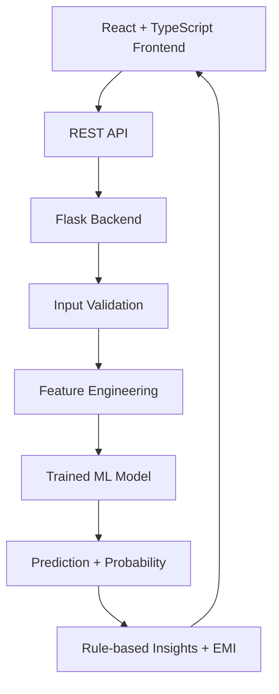

# CreditWise — AI-Powered Loan Approval System

Full-stack machine learning application that estimates loan approval eligibility from applicant financial and demographic inputs.

The product UI and repository are branded **CreditWise**.

**Live Demo:** https://creditwiseloan.netlify.app/
**GitHub:** https://github.com/aasheeshhh/CreditWise-Loan-System

---

## 1. Project overview

CreditWise combines a trained scikit-learn / XGBoost stacking ensemble, a Flask REST API, and a React + TypeScript frontend to deliver real-time loan approval predictions with probability scores, EMI estimates, and rule-based prediction insights.

## 2. Problem statement

Manual loan screening is slow and inconsistent. This project demonstrates an end-to-end decision-support system that:

- Accepts structured applicant inputs
- Engineers features consistent with training
- Returns an approval/rejection prediction with probability
- Surfaces human-readable insights for the result

It is a **portfolio demonstration**, not a regulated lending product.

## 3. Key features

- Real-time loan approval prediction via `POST /predict`
- Stacking ensemble inference (Logistic Regression + Random Forest + XGBoost)
- Input validation aligned to model training ranges
- Rule-based prediction insights (not live SHAP at inference)
- Estimated EMI and EMI-to-income ratio in the API response
- Health check endpoint for deployment monitoring
- Modern responsive React UI (CreditWise)
- Automated backend tests + frontend lint/build CI

## 4. Architecture



**Request flow:** request → validation → preprocessing → model inference → response

## 5. ML approach

| Stage | Details |
|-------|---------|
| Dataset | `data/loan_approval_data.csv` (current file: 1200 rows). Production model version: `creditwise-realistic-v1` |
| Target | Loan approved / rejected |
| Preprocessing | Median/most-frequent imputation, standard scaling, one-hot encoding inside the sklearn pipeline |
| Feature engineering | Squared DTI ratio and squared credit score; DTI includes new-loan EMI + estimated existing debt service |
| Models evaluated (notebook) | Logistic Regression, Random Forest, XGBoost, Stacking |
| Final / deployed model | `models/model.pkl` — StackingClassifier (LR + RF + XGB → LR meta-learner) |
| Metadata | `models/metadata.pkl` — version, monthly interest rate, feature column list |

Notebook: `notebooks/CreditWise_loan_system.ipynb`  
Note: the notebook evaluation run used an earlier dataset scale; metrics below are from that notebook output and are reported honestly for comparison. The deployed artifact is `creditwise-realistic-v1`.

## 6. Model comparison

Metrics from the training notebook hold-out evaluation (`test_size=0.2`, `random_state=42`):

| Model | Accuracy | Precision | Recall | F1 | ROC-AUC |
|-------|----------|-----------|--------|-----|---------|
| Logistic Regression | 0.9000 | 0.8750 | 0.8033 | 0.8376 | 0.9651 |
| Random Forest | 0.9579 | 0.9077 | 0.9672 | 0.9365 | 0.9788 |
| XGBoost | 0.9579 | 0.9077 | 0.9672 | 0.9365 | 0.9902 |
| **Stacking (selected)** | **0.9579** | **0.9077** | **0.9672** | **0.9365** | **0.9865** |

5-fold CV ROC-AUC (train):

| Model | Mean ROC-AUC (± std) |
|-------|----------------------|
| Logistic Regression | 0.9228 (± 0.0273) |
| Random Forest | 0.9812 (± 0.0111) |
| XGBoost | 0.9918 (± 0.0034) |
| Stacking | 0.9870 (± 0.0074) |

**Why stacking was selected:** competitive accuracy/F1 with strong ROC-AUC while combining complementary base learners, matching the production `model.pkl` architecture.

### Explainability (honest)

- The notebook experiments with SHAP (`explainer.pkl` exists).
- **Production `/predict` does not compute SHAP.** Insights are **rule-based prediction insights** from credit score, EMI-to-income, savings, and loan-to-income thresholds.
- Do not describe the live API as “SHAP-powered.”

## 7. Tech stack

| Layer | Technologies |
|-------|----------------|
| ML | scikit-learn, XGBoost, pandas, NumPy, joblib |
| Backend | Flask, Flask-CORS, Gunicorn |
| Frontend | React, TypeScript, Vite, Tailwind CSS, Framer Motion, Zod |
| Deployment | Render (backend), Vercel (frontend; Netlify config also present) |
| Testing / CI | pytest, pytest-cov, ESLint, GitHub Actions |

## 8. Project structure

```
CreditWise-Loan-System/
├── app/
│   ├── app.py              # Flask entry (gunicorn: app.app:app)
│   ├── routes.py           # /, /health, /predict
│   ├── validation.py
│   ├── preprocessing.py
│   ├── prediction.py       # Inference + rule-based insights
│   ├── model_loader.py
│   └── utils.py            # EMI + category normalization
├── models/
│   ├── model.pkl
│   ├── metadata.pkl
│   ├── xgb_pipeline.pkl    # Not used by API
│   └── explainer.pkl       # Notebook SHAP artifact; not used by API
├── data/
│   └── loan_approval_data.csv
├── notebooks/
│   └── CreditWise_loan_system.ipynb
├── tests/
│   ├── conftest.py
│   ├── test_validation.py
│   ├── test_api.py
│   └── test_model.py
├── frontend/               # CreditWise React app
├── .github/workflows/tests.yml
├── Procfile
├── runtime.txt
├── requirements.txt
└── README.md
```

## 9. API documentation

### `GET /`

Plain text: `CreditWise Backend Running`

### `GET /health`

```json
{
  "status": "healthy",
  "model_loaded": true,
  "model_version": "creditwise-realistic-v1"
}
```

### `POST /predict`

**Required fields:** `income`, `loanAmount`, `loanTerm`, `creditScore`, `age`

**Optional fields:** `coapplicantIncome`, `existingLoans`, `savings`, `collateralValue`, `dependents`, `employmentStatus`, `loanPurpose`, `propertyArea`, `education`, `employerCategory`

#### Accepted ranges

| Field | Range |
|-------|-------|
| `income` | 15,000 – 500,000 |
| `loanAmount` | 50,000 – 15,000,000 |
| `loanTerm` | 12 – 360 (months) |
| `creditScore` | 320 – 850 |

#### Example request

```json
{
  "income": 65000,
  "loanAmount": 250000,
  "loanTerm": 60,
  "creditScore": 720,
  "age": 32,
  "coapplicantIncome": 0,
  "existingLoans": 0,
  "savings": 50000,
  "collateralValue": 0,
  "dependents": 0,
  "employmentStatus": "employed",
  "loanPurpose": "personal",
  "propertyArea": "urban",
  "education": "graduate",
  "employerCategory": "private"
}
```

#### Example success response

```json
{
  "prediction": "Approved",
  "approvalProbability": 0.87,
  "confidence": 0.87,
  "insights": [
    { "type": "positive", "text": "Strong credit score supports approval chances." },
    { "type": "negative", "text": "No major risk signal crossed the configured explanation thresholds." }
  ],
  "suggestions": [
    "Keep debt obligations manageable relative to monthly income.",
    "Maintain healthy savings and credit history."
  ],
  "calculated": {
    "estimatedEmi": 5311.76,
    "emiToIncomeRatio": 0.0817
  }
}
```

#### Error responses

| Status | When | Body |
|--------|------|------|
| 400 | Validation failure / bad types | `{ "error": "<message>" }` |
| 500 | Unexpected server error | `{ "error": "Prediction failed. Please check the application inputs." }` |

## 10. Input validation

Backend (`app/validation.py`) enforces required fields and numeric ranges above. Frontend Zod schema in `frontend/src/lib/predict.functions.ts` mirrors those ranges so invalid forms fail before the API call when possible.

## 11. Testing

```bash
pip install -r requirements.txt
pytest
```

Coverage:

```bash
pytest --cov=app --cov-report=term-missing
```

Suite includes validation, API (`/health`, `/predict`), and model load/inference tests. Tests use the real `model.pkl` (not a full mock of the prediction pipeline).

## 12. Test coverage

Current backend coverage (meaningful app modules): **~98%** via:

```bash
pytest --cov=app --cov-report=term-missing
```

Coverage focuses on validation, routing, preprocessing, and prediction — not inflated by unused artifacts.

## 13. Local setup

### Backend

```bash
pip install -r requirements.txt
python app/app.py
```

API defaults to `http://127.0.0.1:5000`.

### Frontend

```bash
cd frontend
npm install
npm run dev
```

For local development, leave `VITE_API_URL` unset to use the Vite `/api` proxy → `http://127.0.0.1:5000`.

## 14. Environment variables

### Backend

| Variable | Purpose | Default |
|----------|---------|---------|
| `PORT` | Server port | `5000` |
| `CORS_ORIGINS` | Comma-separated allowed origins | `*` (local-friendly) |

Production recommendation:

```bash
CORS_ORIGINS=https://credit-wise-loan-system.vercel.app
```

See `.env.example`.

### Frontend

| Variable | Purpose |
|----------|---------|
| `VITE_API_URL` | Backend base URL (required in production builds) |

See `frontend/.env.example`.

## 15. Deployment

| Component | Platform | Notes |
|-----------|----------|-------|
| Backend | Render | `Procfile`: `gunicorn app.app:app`, Python `3.11.9` (`runtime.txt`) |
| Frontend | Vercel | Live: https://credit-wise-loan-system.vercel.app/ (`frontend/vercel.json`) |
| Frontend (alt) | Netlify | `netlify.toml` still present |

Set `VITE_API_URL` to the Render API URL at build time, and set `CORS_ORIGINS` on Render to the Vercel frontend origin.


## 16. Limitations

- The model is trained on historical / synthetic-style tabular data and may not generalize to every real applicant.
- Predictions are **estimates**, not guarantees of lender approval.
- Model confidence / approval probability is not a legal or credit decision.
- Production insights are **rule-based**, not live SHAP attributions.
- `confidence` in the API currently mirrors `approvalProbability` (probability of class Approved).
- EMI uses a fixed 10% annual rate for feature consistency with training — not a live market rate.
- This system is a **decision-support demonstration**, not a real financial approval authority.
- Notebook metrics and the deployed `creditwise-realistic-v1` artifact may reflect different dataset scales; treat notebook tables as evaluation history, not a live scorecard for every production prediction.

## 17. Future improvements

- Wire optional SHAP values into `/predict` only if latency and dependency cost are acceptable
- Persist evaluation metrics for the exact deployed model version in `metadata.pkl`
- Tighten age/dependents/savings validation ranges
- Add frontend unit tests for numeric input parsing
- Pin Python dependency versions for stricter reproducibility
